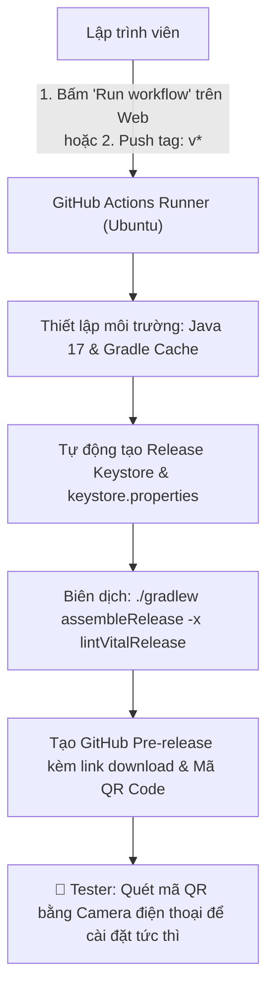

# 🚀 CẨM NANG TOÀN DIỆN: PHÂN PHỐI APP ANDROID CHO TESTER QUA GITHUB ACTIONS & RELEASES

> **Mẫu tài liệu chuẩn (Blueprint / Template) để tái sử dụng cho mọi dự án Android.**  
> Giải pháp phân phối bản dựng APK nội bộ cho Tester: **Zero Firebase**, **Zero Google Cloud Console**, **Hoàn toàn miễn phí**, **Tích hợp sẵn mã QR quét cài đặt ngay trên điện thoại**.

---

## 1. Tổng quan kiến trúc giải pháp

Thay vì phải tạo dự án Firebase, tải `google-services.json`, tạo Service Account JSON phức tạp hoặc đẩy lên Google Play Console, giải pháp này sử dụng **100% tài nguyên của GitHub**:



### ✨ Ưu điểm vượt trội:
- **Zero Configuration local**: Không cần cài Firebase CLI, không cần token phức tạp.
- **Không đụng chạm mã nguồn**: Giữ nguyên toàn bộ dependencies của app, không lo xung đột AGP hay thư viện.
- **Tiện lợi tối đa cho Tester**: Không bắt tester phải cài ứng dụng trung gian (*Firebase App Tester*), chỉ cần mở link hoặc giơ camera điện thoại quét mã QR.
- **Hỗ trợ 2 hình thức kích hoạt**:
  1. Kích hoạt thủ công bằng giao diện web (`workflow_dispatch`), cho phép nhập Release Notes và chọn Pre-release.
  2. Kích hoạt tự động khi gắn Git Tag (ví dụ: `v1.0.0-test`, `v1.2.0-beta`).

---

## 2. Template Workflow hoàn chỉnh cho GitHub Actions

Tạo file tại đường dẫn: **`.github/workflows/distribute-android-release.yml`**

```yaml
name: Distribute APK to GitHub Releases (App Tester)

on:
  workflow_dispatch:
    inputs:
      version_tag:
        description: 'Tên phiên bản / Git Tag (ví dụ: v1.0.0-test hoặc v1.0.0-beta1)'
        required: true
        default: 'v1.0.0-test'
        type: string
      release_title:
        description: 'Tiêu đề bản phát hành'
        required: false
        default: 'Test Build'
        type: string
      release_notes:
        description: 'Ghi chú cập nhật (Changelog cho Tester)'
        required: false
        default: 'Bản build thử nghiệm tính năng mới từ GitHub Actions.'
        type: string
      is_prerelease:
        description: 'Đánh dấu là Pre-release (Dành riêng cho tester)'
        required: true
        default: true
        type: boolean
  push:
    tags:
      - 'v*'

permissions:
  contents: write

concurrency:
  group: distribute-android-release-${{ github.ref }}
  cancel-in-progress: true

jobs:
  build-and-release:
    name: Build APK & Publish Release
    runs-on: ubuntu-latest

    steps:
      - name: 1. Checkout repository
        uses: actions/checkout@v4
        with:
          fetch-depth: 1

      - name: 2. Set up JDK 17
        uses: actions/setup-java@v4
        with:
          distribution: 'temurin'
          java-version: '17'

      - name: 3. Set up Gradle
        uses: gradle/actions/setup-gradle@v3

      - name: 4. Configure Release Keystore
        env:
          KEYSTORE_BASE64: ${{ secrets.RELEASE_KEYSTORE_BASE64 }}
          STORE_PASSWORD: ${{ secrets.RELEASE_STORE_PASSWORD }}
          KEY_ALIAS: ${{ secrets.RELEASE_KEY_ALIAS }}
          KEY_PASSWORD: ${{ secrets.RELEASE_KEY_PASSWORD }}
        run: |
          mkdir -p app
          if [ -n "$KEYSTORE_BASE64" ]; then
            echo "Cấu hình Release KeyStore từ GitHub Secret..."
            echo "$KEYSTORE_BASE64" | base64 --decode > app/release.jks
            cp app/release.jks release.jks
            cat <<EOF > keystore.properties
          STORE_FILE=release.jks
          STORE_PASSWORD=$STORE_PASSWORD
          KEY_ALIAS=$KEY_ALIAS
          KEY_PASSWORD=$KEY_PASSWORD
          EOF
          else
            echo "Tự động sinh Keystore tạm thời cho runner..."
            keytool -genkeypair -v \
              -keystore app/release.jks \
              -alias testkey \
              -keypass android \
              -storepass android \
              -dname "CN=Android App Test, OU=Dev, O=Organization, C=VN" \
              -validity 10000 \
              -keyalg RSA \
              -keysize 2048
            cp app/release.jks release.jks
            cat <<EOF > keystore.properties
          STORE_FILE=release.jks
          STORE_PASSWORD=android
          KEY_ALIAS=testkey
          KEY_PASSWORD=android
          EOF
          fi

      - name: 5. Grant execute permission for gradlew
        run: chmod +x ./gradlew

      - name: 6. Build Release APK
        run: ./gradlew assembleRelease -x lintVitalRelease --stacktrace

      - name: 7. Determine Release Metadata & Rename APK
        id: meta
        run: |
          if [ "${{ github.event_name }}" = "workflow_dispatch" ]; then
            TAG="${{ inputs.version_tag }}"
            TITLE="${{ inputs.release_title }} ($TAG)"
            NOTES="${{ inputs.release_notes }}"
            PRERELEASE="${{ inputs.is_prerelease }}"
          else
            TAG="${{ github.ref_name }}"
            TITLE="App Release $TAG"
            NOTES="Bản phát hành tự động từ Git Tag $TAG."
            PRERELEASE=true
          fi

          # Định danh file APK đầu ra
          APP_NAME="${{ github.event.repository.name }}"
          APK_NAME="${APP_NAME}-${TAG}.apk"
          cp app/build/outputs/apk/release/app-release.apk "./${APK_NAME}"

          DOWNLOAD_URL="https://github.com/${{ github.repository }}/releases/download/${TAG}/${APK_NAME}"
          QR_URL="https://api.qrserver.com/v1/create-qr-code/?size=220x220&data=${DOWNLOAD_URL}"

          echo "tag=$TAG" >> $GITHUB_OUTPUT
          echo "title=$TITLE" >> $GITHUB_OUTPUT
          echo "apk_name=$APK_NAME" >> $GITHUB_OUTPUT
          echo "prerelease=$PRERELEASE" >> $GITHUB_OUTPUT
          echo "download_url=$DOWNLOAD_URL" >> $GITHUB_OUTPUT
          echo "qr_url=$QR_URL" >> $GITHUB_OUTPUT

          # Tạo nội dung mô tả kèm mã QR quét trên điện thoại
          cat <<EOF > release_body.md
          ## 📱 Thông tin bản thử nghiệm (${TAG})

          ${NOTES}

          ---

          ### ⬇️ Hướng dẫn cài đặt cho Tester:
          1. **Tải trực tiếp bằng điện thoại:**
             - [👉 Bấm vào đây để tải ${APK_NAME}](${DOWNLOAD_URL})
          2. **Hoặc quét mã QR dưới đây bằng điện thoại Android để tải ngay:**

          

          ---
          *Bản dựng được tự động xuất bản bởi GitHub Actions.*
          EOF

      - name: 8. Publish GitHub Release with APK & QR Code
        uses: softprops/action-gh-release@v2
        with:
          tag_name: ${{ steps.meta.outputs.tag }}
          name: ${{ steps.meta.outputs.title }}
          body_path: release_body.md
          prerelease: ${{ steps.meta.outputs.prerelease == 'true' }}
          files: ${{ steps.meta.outputs.apk_name }}

      - name: 9. Upload Artifact to GitHub Actions Run
        uses: actions/upload-artifact@v4
        if: success()
        with:
          name: ${{ steps.meta.outputs.apk_name }}
          path: ./${{ steps.meta.outputs.apk_name }}
          retention-days: 14
```

---

## 3. Cấu hình Gradle trong `app/build.gradle.kts`

Để ứng dụng tự động ký số bằng file properties mà không làm gián đoạn việc build thông thường:

```kotlin
import java.io.FileInputStream
import java.util.Properties

// Đọc keystore.properties nếu có
val keystorePropertiesFile = rootProject.file("keystore.properties")
val keystoreProperties = Properties()
if (keystorePropertiesFile.exists()) {
    keystoreProperties.load(FileInputStream(keystorePropertiesFile))
}

android {
    ...
    signingConfigs {
        create("release") {
            val storeFileProp = keystoreProperties.getProperty("STORE_FILE")
            if (!storeFileProp.isNullOrEmpty()) {
                storeFile = file(storeFileProp)
                storePassword = keystoreProperties.getProperty("STORE_PASSWORD")
                keyAlias = keystoreProperties.getProperty("KEY_ALIAS")
                keyPassword = keystoreProperties.getProperty("KEY_PASSWORD")
            } else {
                // Fallback tự động về debug signing nếu chưa có keystore release
                val debugSigning = signingConfigs.getByName("debug")
                storeFile = debugSigning.storeFile
                storePassword = debugSigning.storePassword
                keyAlias = debugSigning.keyAlias
                keyPassword = debugSigning.keyPassword
            }
            // BẮT BUỘC: Khai báo cả V1 và V2 để tương thích từ Android 11 đến Android 15+
            enableV1Signing = true
            enableV2Signing = true
        }
    }

    buildTypes {
        release {
            isMinifyEnabled = true
            isShrinkResources = true
            proguardFiles(getDefaultProguardFile("proguard-android-optimize.txt"), "proguard-rules.pro")
            signingConfig = signingConfigs.getByName("release")
        }
    }

    lint {
        checkReleaseBuilds = false
        abortOnError = false
    }
}
```

---

## 4. Thiết lập bắt buộc trên GitHub Repository (Làm 1 lần)

### 1. Cấp quyền ghi cho GITHUB_TOKEN
Mặc định GitHub Actions có thể bị hạn chế quyền tạo Release. Hãy bật quyền:
1. Vào Repo GitHub > **Settings** > **Actions** > **General**.
2. Tìm mục **Workflow permissions**:
   - Chọn: **Read and write permissions**.
   - Bấm **Save**.

### 2. (Tùy chọn) Ký số bằng Keystore chính thức của bạn
Nếu bạn muốn bản build dùng key chính thức thay vì key tự sinh:
1. Vào **Settings** > **Secrets and variables** > **Actions** > **New repository secret**.
2. Thêm các secret:
   - `RELEASE_KEYSTORE_BASE64`: Chuỗi base64 của file `.jks`.  
     *(Trên PowerShell: `[Convert]::ToBase64String([IO.File]::ReadAllBytes("path/to/key.jks")) | Set-Clipboard`)*
   - `RELEASE_STORE_PASSWORD`: Mật khẩu keystore.
   - `RELEASE_KEY_ALIAS`: Tên alias.
   - `RELEASE_KEY_PASSWORD`: Mật khẩu alias.

---

## 5. Cẩm nang xử lý 5 lỗi kinh điển (Troubleshooting Bible)

| Lỗi | Triệu chứng | Nguyên nhân cốt lõi | Cách xử lý dứt điểm |
| :--- | :--- | :--- | :--- |
| **1. Mất nút Run workflow** | Tab Actions chỉ hiện *"Choose a workflow / Found 0 workflows"* | File workflow chưa có trên nhánh mặc định (`master`/`main`). Sự kiện `workflow_dispatch` bắt buộc phải có trên nhánh chính. | Merge commit workflow vào nhánh `master`/`main`. |
| **2. Thiếu file gradlew** | `chmod: cannot access './gradlew': No such file or directory` | Repo phát triển trên Windows chỉ có `gradlew.bat`, thiếu file thực thi `gradlew` của Unix. | Chạy `.\gradlew.bat wrapper` để sinh file, sau đó chạy: `git add --chmod=+x gradlew` rồi commit. |
| **3. Không tìm thấy Keystore** | `Keystore file '.../app/release.jks' not found for signing config` | Module `:app` tìm đường dẫn tương đối trong thư mục con `app/`. Nếu tạo key ở thư mục gốc repo sẽ bị lỗi. | Trong workflow, tạo key trực tiếp tại `app/release.jks` và copy ra cả thư mục root. |
| **4. Lỗi Artifact upload** | `Input required and not supplied: path` | Khi bước build bị fail, step metadata bị bỏ qua nên biến `path` bị rỗng. Dùng `if: always()` khiến upload cố chạy với path rỗng. | Đổi điều kiện step upload thành `if: success()`. |
| **5. Android báo "Chưa được cài đặt"** | Tải APK về máy (Samsung S24/S25, Android 14/15), bấm "Vẫn cài đặt" qua Play Protect nhưng báo *Chưa được cài đặt*. | **Xung đột chữ ký (Signature Mismatch):** Máy đã có sẵn app cũ (cài từ Android Studio bằng debug key). Android cấm cài đè khi chữ ký khác nhau. | 1. **Gỡ cài đặt (Uninstall)** bản app cũ trong *Cài đặt > Ứng dụng*.<br>2. Mở file APK bằng ứng dụng **File của bạn (My Files)** để cài đặt. |

---

## 6. Hướng dẫn nhanh cho Tester cài app

Khi nhận được link GitHub Release:
1. **Cách 1 (Nhanh nhất):** Dùng camera điện thoại Android quét **Mã QR Code** hiển thị trên trang Release -> Trình duyệt sẽ tự động tải file `.apk` về máy.
2. **Cách 2:** Mở trình duyệt trên điện thoại, bấm trực tiếp vào file `.apk` (ví dụ `EpubPro-v1.0.0-test.apk`) để tải về.
3. Khi cài đặt:
   - Nếu Play Protect cảnh báo: Bấm **Chi tiết (Details)** > Chọn **Vẫn cài đặt (Install anyway)**.
   - Luôn đảm bảo đã gỡ bỏ bản app cũ trước khi cài đặt bản mới.
