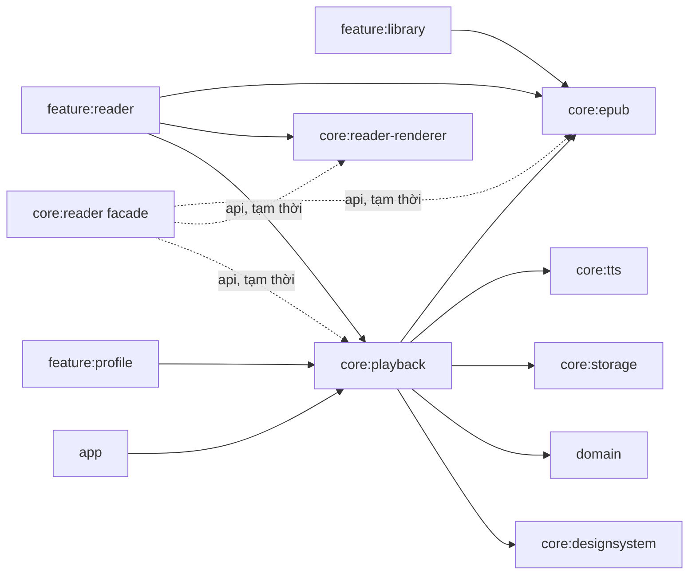

# P3 — Kế hoạch tách module `core:reader`

> Trạng thái: Đã chốt thiết kế, chưa triển khai production code  
> Ngày: 2026-08-17

## 1. Kết quả cần đạt

Tách `core:reader` thành ba module có ownership rõ ràng:

- `core:epub`: đọc, parse và chuẩn hóa nội dung EPUB.
- `core:reader-renderer`: chuẩn bị nội dung an toàn và contract render WebView.
- `core:playback`: điều phối TTS và toàn bộ Android playback runtime.

`core:reader` chỉ tồn tại tạm thời như compatibility facade. Sau khi tất cả consumer chuyển sang dependency trực tiếp và hoàn tất validation, facade sẽ bị xóa.

## 2. Hiện trạng đã kiểm chứng

| Consumer | API đang dùng từ `core:reader` |
|---|---|
| `feature:library` | `EpubEngine` |
| `feature:reader` | EPUB engine, renderer, JS bridge và TTS contracts/service |
| `feature:profile` | `AndroidNativeTtsEngine`, `TtsService` |
| `app` | `TtsService`, open-book/widget contracts và manifest service |

Module hiện tại đồng thời kéo Hilt, storage, native TTS, Compose, lifecycle, MediaSession, Jsoup và domain vào mọi consumer. Trong playback có nhiều declaration `internal` được `TtsService` sử dụng, gồm cursor resolver, presentation, power policy, move queue, notification và bubble runtime. Do Kotlin `internal` chỉ có hiệu lực trong một Gradle module, toàn bộ playback phải được chuyển nguyên khối; không nới visibility chỉ để phục vụ migration.

## 3. Phạm vi và non-goals

### Trong phạm vi

- Tạo ba Android library module mới.
- Di chuyển source, unit test và dependency về đúng ownership.
- Chuyển consumer sang dependency trực tiếp.
- Di chuyển string hiển thị sang `core:designsystem`.
- Giữ ứng dụng build được sau từng PR merge.
- Xóa compatibility facade sau validation.

### Không thuộc P3

- Không sửa parser, pagination, sanitizer hoặc logic playback.
- Không đổi package Kotlin/FQCN public.
- Không đổi Intent action/extra, notification/channel ID hoặc storage schema.
- Không chuyển Android Media sang Media3.
- Không refactor `TtsService`, coroutine scope, Binder hoặc Hilt architecture.
- Không tối ưu build ngoài kết quả tự nhiên của việc giảm dependency.

## 4. Kiến trúc đích



`core:reader-renderer` không phụ thuộc `core:epub`: `feature:reader` là orchestration layer truyền chapter content sang WebView. Điều này tránh một dependency không tồn tại trong source hiện tại.

## 5. Ownership source và dependency

### `core:epub`

Di chuyển:

- `engine/EpubEngine.kt`
- `engine/EpubReadLimits.kt`
- `engine/HtmlNormalizer.kt`
- Toàn bộ `src/test/.../engine/*`

Dependency: `domain`, Hilt, coroutines, Jsoup, JUnit.

### `core:reader-renderer`

Di chuyển:

- `bridge/ReaderJsBridge.kt`
- `style/CssInjector.kt`
- `filter/EpubHtmlSanitizer.kt`
- Test bridge, style, horizontal pagination và EPUB HTML sanitizer.

Dependency: `domain`, Android WebKit, Jsoup, JSON cho unit test và JUnit. Module này không cần Hilt, Compose, storage hoặc TTS.

### `core:playback`

Di chuyển nguyên khối trong cùng một PR:

- Toàn bộ `tts/**`, gồm engine adapters, parser/segmenter, coordinator, policies, contracts, service, MediaSession và audio focus.
- Toàn bộ `tts/bubble/**` và `tts/notification/**`.
- `filter/ContentSanitizer.kt`.
- Toàn bộ test TTS, bubble, notification và content sanitizer.

Dependency: `core:epub`, `core:tts`, `core:storage`, `core:designsystem`, `domain`, Hilt, coroutines, lifecycle, savedstate, Compose, AndroidX Media, Jsoup, JUnit và Mockito.

### `core:reader` facade

Trong giai đoạn chuyển tiếp, module không giữ implementation/resource và chỉ expose:

```kotlin
api(project(":core:epub"))
api(project(":core:reader-renderer"))
api(project(":core:playback"))
```

Không tạo wrapper, typealias hoặc API thay thế.

## 6. Compatibility contract bắt buộc

- Giữ `com.epubpro.core.reader.tts.TtsService` để app manifest không đổi component identity.
- Giữ package hiện tại của `EpubEngine`, `ReaderJsBridge`, `CssInjector`, sanitizer và toàn bộ playback trong P3.
- Giữ nguyên public/internal visibility; playback atomic move bảo toàn biên `internal`.
- Giữ nguyên constructor, Hilt annotation, kiểu trả về và exception contract.
- Giữ nguyên Intent actions, extra keys, widget broadcast, notification ID và channel ID.
- Giữ nguyên `foregroundServiceType`, `exported`, `stopWithTask` và special-use property.
- Giữ nguyên coroutine dispatcher, cancellation/generation guard và cleanup lifecycle.
- Giữ nguyên tên/giá trị string resource khi chuyển sang `core:designsystem`.
- Không đổi SharedPreferences/Room keys hoặc playback snapshot format.

## 7. Execution plan cuối cùng

### P3.0 — Baseline và change isolation

- [ ] Đảm bảo các fix P0–P2 đã merge hoặc được tách khỏi nhánh P3.
- [ ] Chụp danh sách file thay đổi hiện có; không ghi đè thay đổi ngoài scope.
- [ ] Ghi baseline test/build và mọi lỗi đã tồn tại trước migration.
- [ ] Chụp các reference tới `:core:reader`, `com.epubpro.core.reader` và manifest service.
- [ ] Chốt danh sách Intent/resource constants bằng contract test hiện tại.

Gate:

```powershell
.\gradlew.bat :core:reader:testDebugUnitTest
.\gradlew.bat :feature:reader:testDebugUnitTest
.\gradlew.bat :feature:library:compileDebugKotlin :feature:profile:compileDebugKotlin
.\gradlew.bat :app:assembleDebug
```

### P3.1 — Module skeleton và facade

- [ ] Thêm ba module vào `settings.gradle.kts`.
- [ ] Tạo `build.gradle.kts` với compile SDK 34, min SDK 26 và JVM 17.
- [ ] Dùng namespace `com.epubpro.core.epub`, `com.epubpro.core.reader.renderer`, `com.epubpro.core.playback`.
- [ ] Khai báo dependency tối thiểu theo ownership.
- [ ] Thêm ba dependency `api` vào `core:reader`.
- [ ] Chưa chuyển source hoặc consumer.

Gate: Gradle sync, `:app:assembleDebug` và kiểm tra không có dependency cycle.

### P3.2 — Atomic move `core:epub`

- [ ] Dùng move thuần túy cho ba file engine và toàn bộ engine tests.
- [ ] Giữ nguyên package/import/API và không format ngoài phạm vi.
- [ ] Chuyển dependency/test dependency cần thiết sang module mới.
- [ ] Xóa source/test cũ sau khi xác nhận không có duplicate class.

Gate:

```powershell
.\gradlew.bat :core:epub:testDebugUnitTest
.\gradlew.bat :core:reader:testDebugUnitTest
.\gradlew.bat :feature:library:compileDebugKotlin :feature:reader:compileDebugKotlin
.\gradlew.bat :app:assembleDebug
```

### P3.3 — Atomic move `core:reader-renderer`

- [ ] Chuyển bridge, CSS injector, EPUB HTML sanitizer và test tương ứng.
- [ ] Giữ `ContentSanitizer` trong module cũ cho tới bước playback.
- [ ] Loại dependency Hilt/Compose/storage/TTS khỏi renderer.
- [ ] Xác nhận `feature:reader` vẫn compile qua facade.

Gate:

```powershell
.\gradlew.bat :core:reader-renderer:testDebugUnitTest
.\gradlew.bat :feature:reader:testDebugUnitTest
.\gradlew.bat :app:assembleDebug
```

### P3.4 — Resource relocation

- [ ] Merge `core/reader/src/main/res/values/strings.xml` và `tts_service_strings.xml` vào `core/designsystem/src/main/res/values/strings.xml`.
- [ ] Giữ nguyên resource name, placeholder và value.
- [ ] Đổi import `com.epubpro.core.reader.R`/`ReaderR` sang `com.epubpro.core.designsystem.R`.
- [ ] Không thêm hardcoded user-facing string.
- [ ] Kiểm tra resource collision và formatted-string arguments.

Gate: `:core:reader:testDebugUnitTest`, resource merge và `:app:assembleDebug`.

### P3.5 — Atomic move toàn bộ `core:playback`

- [ ] Chuyển `tts/**`, `ContentSanitizer` và toàn bộ test liên quan trong cùng một PR.
- [ ] Không chia service và helper `internal` sang hai module khác nhau.
- [ ] Thêm dependency trực tiếp `app -> core:playback` ngay khi service được chuyển.
- [ ] Giữ nguyên FQCN service và manifest tại `app`.
- [ ] Xác nhận Hilt aggregation có `TtsService`, engine adapters và coordinator.
- [ ] Xác nhận `core:reader` không còn source/resource sau bước này.

Gate:

```powershell
.\gradlew.bat :core:playback:testDebugUnitTest
.\gradlew.bat :core:reader:testDebugUnitTest
.\gradlew.bat :feature:reader:compileDebugKotlin :feature:profile:compileDebugKotlin
.\gradlew.bat :app:processDebugMainManifest
.\gradlew.bat :app:assembleDebug
```

Kiểm tra merged manifest chỉ có một `TtsService` với đầy đủ thuộc tính FGS hiện tại.

### P3.6 — Chuyển consumer và tài liệu ownership

- [ ] `feature:library`: thay `core:reader` bằng `core:epub`.
- [ ] `feature:reader`: dùng trực tiếp EPUB, renderer và playback.
- [ ] `feature:profile`: dùng trực tiếp playback; giữ `core:tts` nếu còn import API của module đó.
- [ ] `app`: xóa `core:reader`, giữ `core:playback` trực tiếp.
- [ ] Không đổi Kotlin imports trong P3 vì package được giữ.
- [ ] Tạo/cập nhật `AGENTS.md` cho ba module với invariants và test commands tương ứng.
- [ ] Cập nhật sơ đồ kiến trúc/tài liệu có đường dẫn module cũ.

Gate: search không còn `project(":core:reader")` ngoài facade/validation và toàn bộ build matrix đạt.

### P3.7 — Validation cycle và xóa facade

- [ ] Hoàn tất unit, lint, debug/release build và smoke test thiết bị.
- [ ] Xác nhận không còn production consumer của `:core:reader`.
- [ ] Xóa `include(":core:reader")` và thư mục module facade.
- [ ] Chạy lại search reference, dependency graph và toàn bộ final gate.
- [ ] Không thực hiện package rename trong PR này.

Final gate:

```powershell
.\gradlew.bat :core:epub:testDebugUnitTest :core:reader-renderer:testDebugUnitTest :core:playback:testDebugUnitTest
.\gradlew.bat :feature:reader:testDebugUnitTest
.\gradlew.bat :app:lintDebug
.\gradlew.bat :app:assembleDebug :app:assembleRelease
```

## 8. Smoke test thiết bị bắt buộc

### EPUB và renderer

- Import/mở EPUB hợp lệ và malformed EPUB.
- Chuyển chapter trước/sau, bao gồm đầu/cuối sách.
- Kiểm tra chế độ cuộn dọc và phân trang ngang.
- Thay font/theme/margin, xác nhận semantic position và JS bridge không regress.
- Mở sách chứa active HTML để xác nhận sanitizer/WebView boundary còn hiệu lực.

### Playback

- Native TTS và Piper: play, pause, resume, stop, next/previous paragraph/chapter.
- Đổi voice/speed mà không tự phát ngoài ý muốn.
- Điều khiển từ notification, lock screen và MediaSession.
- Mất/lấy audio focus, rút/cắm headset, đưa app background/foreground.
- Khôi phục snapshot sau khi app UI bị đóng; kiểm tra sleep timer.
- Bubble: permission grant/deny, kéo, mở rộng, ẩn, khóa/mở khóa và xoay màn hình.
- Widget audio/reading: play/pause/next/previous/open-book khi app UI không chạy.

## 9. Rủi ro và biện pháp kiểm soát

| Rủi ro | Kiểm soát |
|---|---|
| `internal` mất visibility | Move toàn bộ playback nguyên khối, không public hóa tạm thời |
| Hilt missing binding/entry point | App phụ thuộc playback trực tiếp; compile app sau move |
| Mất service khi manifest merge | Giữ FQCN; kiểm tra merged manifest và chỉ một service |
| Lỗi `R` sau đổi namespace | Relocate string trước playback; dùng `core.designsystem.R` |
| Dependency cycle | Facade chỉ đứng trên ba module; renderer độc lập; playback chỉ trỏ xuống EPUB/TTS/storage |
| Regression lifecycle/concurrency | Không refactor logic; chạy unit + device smoke cho FGS/audio/bubble/widget |
| R8 missing class | Bắt buộc `assembleRelease` trước xóa facade |
| Diff khó review | Mỗi PR chỉ move một ownership group, không auto-format toàn file |

## 10. Rollback strategy

- Mỗi bước phải là một PR build xanh và có thể revert độc lập theo thứ tự ngược.
- Trước khi xóa facade, rollback consumer chỉ cần trả dependency về `core:reader`.
- Nếu P3.5 lỗi runtime, revert toàn bộ atomic playback PR; không giữ trạng thái nửa service/nửa helper giữa hai module.
- Không migration storage/database nên rollback không cần chuyển đổi dữ liệu người dùng.
- Không xóa module cũ trước khi final validation đạt.

## 11. Definition of Done

- Ba module mới có ownership/dependency đúng thiết kế.
- Không còn `:core:reader` trong settings hoặc production Gradle dependency.
- Không có duplicate class/resource hoặc dependency cycle.
- Public FQCN và Android component identity chưa đổi.
- Unit test, lint, debug build và release/R8 build đạt.
- Merged manifest và Hilt graph hợp lệ.
- Smoke test EPUB/WebView/TTS/bubble/widget đạt trên thiết bị.
- Không phát sinh hardcoded string, schema migration hoặc behavioral refactor.
- Module documentation và decision log được cập nhật.

## 12. Nhật ký quyết định

| ID | Quyết định | Phương án bỏ qua | Lý do |
|---|---|---|---|
| D-001 | Ba module + facade tạm thời | Giữ monolith hoặc chỉ tách hai module | Ownership rõ hơn và giảm dependency surface |
| D-002 | Migration tuần tự | Big-bang toàn repository | Diff nhỏ, rollback và khoanh vùng regression tốt hơn |
| D-003 | Không tạo `core:reader-api` | Contract module thứ tư | Chưa đủ consumer để biện minh abstraction mới |
| D-004 | Renderer độc lập với EPUB | `renderer -> epub` | Source hiện tại không có dependency trực tiếp |
| D-005 | `ContentSanitizer` thuộc playback | Đặt tại renderer/EPUB | Consumer production hiện tại là `TtsService` |
| D-006 | Giữ package cũ trong P3 | Rename đồng thời | Tránh trộn move module với API migration |
| D-007 | Facade dùng Gradle `api` | Wrapper/typealias | Bảo toàn API mà không tạo code tạm |
| D-008 | Giữ FQCN `TtsService` | Đổi manifest component | Tránh thay đổi Android component identity |
| D-009 | Playback move nguyên khối | Tách pure core và Android runtime thành hai PR | Bảo toàn Kotlin `internal` và tránh nới public API |
| D-010 | String hiển thị thuộc designsystem | Giữ resource trong playback | Tuân thủ quy định string resource của repository |
| D-011 | Package cleanup sau P3 | Rename ngay | Giữ P3 behavior-neutral và dễ review |

