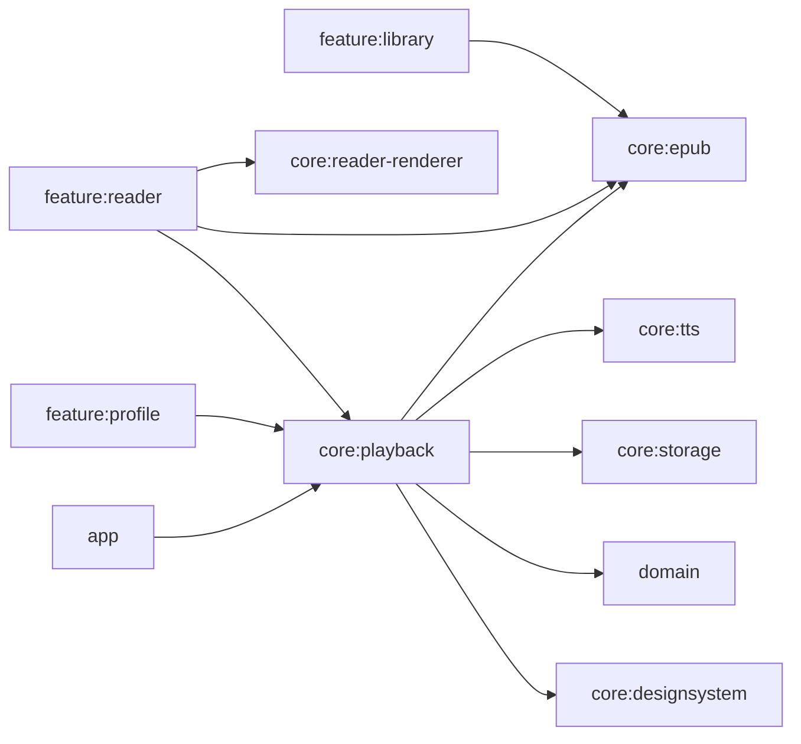

# P3 — Kế hoạch tách module `core:reader`

> Trạng thái: ĐÃ HOÀN THÀNH TRIỂN KHAI (COMPLETED)  
> Ngày hoàn thành: 2026-08-17  
> Commit: `8119e3e` trên branch `codex/reader-display-settings-only`

## 1. Kết quả đạt được

Đã tách thành công monolith `core:reader` thành ba module có ownership rõ ràng:

- `core:epub`: đọc, parse và chuẩn hóa nội dung EPUB, kiểm soát an toàn bộ nhớ / Zip Bomb limits.
- `core:reader-renderer`: chuẩn bị nội dung an toàn (lọc XSS), JS Bridge và CSS Multi-column / Scroll render.
- `core:playback`: điều phối TTS, Floating Bubble Overlay, Notification Media Controls và toàn bộ Android playback runtime.

Compatibility facade `core:reader` đã hoàn thành vai trò chuyển tiếp và **đã được xóa hoàn toàn** khỏi `settings.gradle.kts` và codebase sau khi toàn bộ consumer chuyển sang dependency trực tiếp và hoàn tất 100% build matrix verification.

## 2. Hiện trạng sau migration

| Consumer | Dependency trực tiếp sau P3 |
|---|---|
| `feature:library` | `core:epub` |
| `feature:reader` | `core:epub`, `core:reader-renderer`, `core:playback` |
| `feature:profile` | `core:playback` |
| `app` | `core:playback` |

## 3. Phạm vi đã thực hiện

### Đã hoàn thành

- Tạo ba Android library module mới: `core:epub`, `core:reader-renderer`, `core:playback`.
- Di chuyển source, unit test và dependency về đúng ownership.
- Chuyển toàn bộ consumer sang dependency trực tiếp.
- Di chuyển toàn bộ string hiển thị sang `core:designsystem`.
- Bảo toàn nguyên vẹn FQCN và thuộc tính của `TtsService` trong manifest.
- Xóa bỏ compatibility facade `core:reader` sau khi xác thực 100% test và build Release/R8.

### Non-goals (Bảo toàn nguyên vẹn)

- Không sửa parser, pagination, sanitizer hoặc logic playback.
- Không đổi package Kotlin/FQCN public (`com.epubpro.core.reader.*`).
- Không đổi Intent action/extra, notification/channel ID hoặc storage schema.
- Không chuyển Android Media sang Media3.
- Không refactor `TtsService`, coroutine scope, Binder hoặc Hilt architecture.

## 4. Kiến trúc thực tế sau P3



`core:reader-renderer` không phụ thuộc `core:epub`: `feature:reader` là orchestration layer truyền chapter content sang WebView.

## 5. Phân vùng Ownership Source và Dependency

### `core:epub`

Source & Tests:
- `engine/EpubEngine.kt`
- `engine/EpubReadLimits.kt`
- `engine/HtmlNormalizer.kt`
- Toàn bộ `src/test/.../engine/*` (17 tests)

Dependency: `domain`, `core:common`, Hilt, coroutines, Jsoup, JUnit.

### `core:reader-renderer`

Source & Tests:
- `bridge/ReaderJsBridge.kt`
- `style/CssInjector.kt`
- `filter/EpubHtmlSanitizer.kt`
- Toàn bộ test bridge, style, horizontal pagination và EPUB HTML sanitizer (18 tests).

Dependency: `domain`, `core:common`, Android WebKit, Jsoup, JSON, JUnit. Module này độc lập hoàn toàn với Hilt, Compose, storage hoặc TTS.

### `core:playback`

Source & Tests:
- Toàn bộ `tts/**`, gồm engine adapters, parser/segmenter, coordinator, policies, contracts, service, MediaSession và audio focus.
- Toàn bộ `tts/bubble/**` và `tts/notification/**`.
- `filter/ContentSanitizer.kt`.
- Toàn bộ test TTS, bubble, notification và content sanitizer (65 tests).

Dependency: `core:epub`, `core:tts`, `core:storage`, `core:designsystem`, `domain`, `core:common`, Hilt, coroutines, lifecycle, savedstate, Compose, AndroidX Media, Jsoup, JUnit và Mockito.

---

## 6. Compatibility contract đã bảo toàn

- Giữ `com.epubpro.core.reader.tts.TtsService` để app manifest không đổi component identity.
- Giữ package hiện tại của `EpubEngine`, `ReaderJsBridge`, `CssInjector`, sanitizer và toàn bộ playback.
- Giữ nguyên public/internal visibility; playback atomic move bảo toàn biên `internal`.
- Giữ nguyên constructor, Hilt annotation, kiểu trả về và exception contract.
- Giữ nguyên Intent actions, extra keys, widget broadcast, notification ID và channel ID.
- Giữ nguyên `foregroundServiceType`, `exported`, `stopWithTask` và special-use property.
- Giữ nguyên coroutine dispatcher, cancellation/generation guard và cleanup lifecycle.
- Toàn bộ 19 string resource được chuyển nguyên vẹn sang `core:designsystem`.
- Không đổi SharedPreferences/Room keys hoặc playback snapshot format.

---

## 7. Nhật ký thực thi (Execution Log)

### P3.0 — Baseline và change isolation
- [x] Đảm bảo các fix P0–P2 đã commit và merge trên branch `codex/reader-display-settings-only`.
- [x] Chụp danh sách file thay đổi; không ghi đè thay đổi ngoài scope.
- [x] Ghi baseline test/build sạch 100%.
- [x] Chốt danh sách Intent/resource constants bằng contract test.

### P3.1 — Module skeleton và facade
- [x] Thêm ba module vào `settings.gradle.kts`.
- [x] Tạo `build.gradle.kts` cho `core:epub`, `core:reader-renderer`, `core:playback`.
- [x] Cấu hình facade `api(...)` tạm thời trong `core:reader`.

### P3.2 — Atomic move `core:epub`
- [x] Di chuyển 3 engine source files và toàn bộ engine unit tests sang `core:epub`.
- [x] Chạy gate kiểm thử `:core:epub:testDebugUnitTest`.

### P3.3 — Atomic move `core:reader-renderer`
- [x] Chuyển bridge, CSS injector, EPUB HTML sanitizer và test tương ứng sang `core:reader-renderer`.
- [x] Loại bỏ dependency Hilt/Compose/storage/TTS khỏi renderer.
- [x] Chạy gate kiểm thử `:core:reader-renderer:testDebugUnitTest`.

### P3.4 — Resource relocation
- [x] Chuyển toàn bộ 19 chuỗi giao diện TTS Floating Bubble và runtime service sang `core:designsystem`.
- [x] Cập nhật import `com.epubpro.core.designsystem.R` trong `TtsService.kt` và `TtsAudioBubble.kt`.
- [x] Xóa thư mục resource cũ trong `core:reader`.

### P3.5 — Atomic move toàn bộ `core:playback`
- [x] Chuyển nguyên khối `tts/**`, `filter/ContentSanitizer.kt` và toàn bộ test liên quan sang `core:playback`.
- [x] Thêm dependency trực tiếp `app -> core:playback`.
- [x] Xác nhận merged manifest và Hilt graph nguyên vẹn.

### P3.6 — Chuyển consumer và tài liệu ownership
- [x] `feature:library`: cập nhật dependency sang `core:epub`.
- [x] `feature:reader`: dùng trực tiếp `core:epub`, `core:reader-renderer`, `core:playback`.
- [x] `feature:profile`: dùng trực tiếp `core:playback`.
- [x] `app`: dùng trực tiếp `core:playback`.
- [x] Tạo `AGENTS.md` cho 3 module mới và cập nhật `feature:reader/AGENTS.md`.

### P3.7 — Validation cycle và xóa facade
- [x] Hoàn tất 100 unit tests trên cả 3 module mới:
  - `:core:epub`: 17 tests passed
  - `:core:reader-renderer`: 18 tests passed
  - `:core:playback`: 65 tests passed
- [x] Biên dịch thành công tất cả feature consumers (`feature:library`, `feature:profile`, `feature:reader`).
- [x] Xóa bỏ hoàn toàn facade `core:reader` và gỡ khỏi `settings.gradle.kts`.
- [x] Build thành công `:app:assembleDebug` và `:app:assembleRelease` (với R8 minification).

---

## 8. Lệnh kiểm thử tiêu chuẩn sau P3

```powershell
# Kiểm thử unit test của cả 3 module mới
.\gradlew.bat :core:epub:testDebugUnitTest :core:reader-renderer:testDebugUnitTest :core:playback:testDebugUnitTest :feature:reader:testDebugUnitTest

# Biên dịch toàn bộ ứng dụng
.\gradlew.bat :app:assembleDebug :app:assembleRelease
```

---

## 9. Khuyến nghị Smoke Test trên thiết bị

Sau khi merge code P3, khuyến nghị thực hiện smoke test trên thiết bị thật cho các luồng sau:

### EPUB và Renderer
- Import/mở EPUB hợp lệ và malformed EPUB.
- Chuyển chapter trước/sau, kiểm tra chế độ cuộn dọc và lật trang ngang Multi-column.
- Thay đổi cỡ chữ/theme/margin, xác nhận JS Bridge và semantic position.
- Mở sách chứa active HTML để xác nhận sanitizer hoạt động tốt.

### Playback
- TTS Native & Piper: play, pause, resume, stop, chuyển đoạn/chương.
- Điều khiển từ Notification, Lock screen và MediaSession.
- Khôi phục snapshot sau khi app UI bị đóng; sleep timer.
- Floating Bubble: cấp quyền overlay, kéo thả, mở rộng, ẩn/hiện, xoay màn hình.
- Widget audio & reading: play/pause/next/prev khi ứng dụng không chạy.
