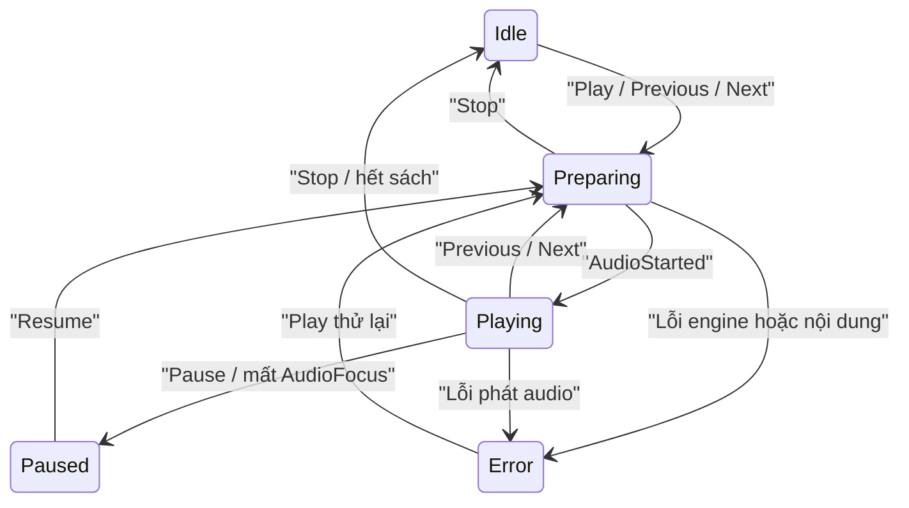

# Thiết kế bong bóng điều khiển TTS

> Cập nhật: 2026-08-10  
> Trạng thái: Đã được người dùng xác nhận

## 1. Mục tiêu

Tạo bong bóng điều khiển audio dạng `TYPE_APPLICATION_OVERLAY`, xuất hiện trên ứng dụng khác khi người dùng chủ động bật. Bong bóng dùng chung phiên TTS, MediaSession và notification hiện tại; hỗ trợ điều khiển kể cả khi playback đã Stop và đang ở trạng thái Idle.

Tính năng dành cho người dùng nghe sách trong lúc sử dụng ứng dụng khác, cần truy cập nhanh Previous, Play/Pause, Next, Stop và quay lại đúng sách đang nghe.

## 2. Phạm vi đã khóa

- Bong bóng được bật/tắt bằng công tắc trong Cài đặt.
- Khi thiếu quyền overlay, app mở thẳng màn `ACTION_MANAGE_OVERLAY_PERMISSION`; quay lại app sẽ tự hoàn tất bật nếu quyền đã được cấp.
- Trên Android 13+, app xin `POST_NOTIFICATIONS` khi bật bong bóng. Nếu người dùng từ chối, bong bóng vẫn được bật nhưng app giải thích notification Idle có thể chỉ xuất hiện trong Task Manager.
- Bong bóng tiếp tục tồn tại sau Stop và sau khi vuốt EpubPro khỏi Recent Apps.
- Force stop luôn đóng service và bong bóng; không tìm cách vượt giới hạn này.
- Không tự khởi động bong bóng sau reboot. Người dùng phải mở EpubPro một lần.
- Trong EpubPro, overlay tạm ẩn và mini player hiện tại tiếp quản.
- Khi khóa màn hình, overlay tạm ẩn; notification là kênh điều khiển duy nhất.
- Chỉ hỗ trợ một bong bóng và một phiên TTS.
- Không dùng Android Notification Bubble API vì đây không phải luồng conversation.

## 3. Hành vi người dùng

### 3.1 Bong bóng thu gọn

- Hiển thị ảnh bìa tròn, vòng tiến trình và biểu tượng trạng thái Play/Pause/Preparing.
- Kéo tự do, tự hút vào cạnh gần nhất và lưu cạnh cùng tỷ lệ vị trí dọc.
- Chạm để mở bảng điều khiển.
- Khi kéo gần đáy màn hình, hiển thị vùng Ẩn. Thả vào vùng này chỉ ẩn bong bóng cho phiên hiện tại; công tắc vẫn Bật.
- Bong bóng đã ẩn chỉ tự xuất hiện lại khi bắt đầu một phiên TTS mới.

### 3.2 Bảng điều khiển mở rộng

- Hiển thị ảnh bìa, tên sách, một dòng nội dung hiện tại và thanh tiến trình.
- Có Previous, Play/Pause, Next, Stop và Mở sách.
- Nút Mở sách đưa người dùng tới đúng `bookId`, chương gần nhất và mở Audio Player toàn màn hình.
- Chạm ngoài bảng để thu gọn; không tự đóng theo timer.
- Khi chưa có snapshot, các nút playback bị vô hiệu hóa và người dùng dùng Mở sách để chọn nội dung.

### 3.3 Idle

Idle nghĩa là phiên TTS đã dừng hoàn toàn: engine và AudioFocus được giải phóng, không còn timer tiến trình, nhưng service bong bóng và notification vẫn tồn tại.

- Play dựng lại snapshot gần nhất và phát từ câu đã lưu.
- Previous/Next dựng lại snapshot, chuyển câu tương ứng và phát ngay.
- Stop trong Idle là lệnh idempotent: không xóa snapshot và không đóng bong bóng.
- Previous/Next vượt biên chương dùng `TtsChapterPlaybackCoordinator`.

## 4. Kiến trúc

Giữ một `TtsService` duy nhất sở hữu playback, MediaSession, notification và vòng đời overlay. Không tạo foreground service thứ hai.

### 4.1 Thành phần

- `TtsService`: nguồn sự thật và command dispatcher duy nhất.
- `TtsBubbleOverlayController`: gắn/gỡ `WindowManager`, render bong bóng và xử lý gesture.
- `TtsBubblePreferencesManager`: lưu công tắc, vị trí cạnh màn hình và trạng thái ẩn tạm.
- `TtsPlaybackSnapshotStore`: lưu con trỏ cần thiết để dựng lại phiên Idle.
- `AppVisibilityTracker`: xác định Activity EpubPro có đang hiển thị hay không.
- `DeviceLockTracker`: theo dõi khóa/mở khóa và kiểm tra lại bằng `KeyguardManager`.
- `TtsMediaSessionManager`: tiếp tục xây cùng một notification và ánh xạ action về service.

Overlay dùng `ComposeView` không có ViewModel riêng. Service cung cấp model giao diện bất biến qua `StateFlow`; composable chỉ render và gửi command.

### 4.2 Hai state độc lập

`TtsPlayerState` tiếp tục mô tả playback: Idle, Preparing, Playing, Paused, Error và Completed.

`TtsBubbleState` mô tả UI overlay: Disabled, Hidden, Collapsed và Expanded.

Một reducer thuần kết hợp:

- playback state;
- công tắc và quyền overlay;
- app foreground/background;
- trạng thái khóa máy;
- `hiddenForCurrentSession`;

để quyết định bubble state và notification model. Không nhồi trạng thái overlay vào `TtsPlayerState`.

## 5. Luồng lệnh và chống race

Mọi action từ Reader, full player, mini player, notification, MediaSession và overlay đi qua `TtsCommandDispatcher` trong service. Lệnh được serialize trên main dispatcher.

Quy tắc:

- Stop tăng `playbackGeneration` trước khi hủy engine/I/O.
- Callback engine, restore snapshot và chuyển chương đều kiểm tra generation sau mọi suspend boundary.
- Lệnh lặp lại phải idempotent.
- Bắt đầu một phiên mới xóa `hiddenForCurrentSession`; Pause/Resume trong cùng phiên không xóa cờ này.
- Progress của notification và bong bóng dùng chung timeline và một tick tối đa mỗi giây khi Playing.

## 6. Foreground service và notification

Manifest khai báo:

- `android.permission.SYSTEM_ALERT_WINDOW`;
- `android.permission.POST_NOTIFICATIONS`;
- `android.permission.FOREGROUND_SERVICE_SPECIAL_USE`;
- `android:foregroundServiceType="mediaPlayback|specialUse"`;
- `android.app.PROPERTY_SPECIAL_USE_FGS_SUBTYPE` mô tả bong bóng điều khiển TTS do người dùng chủ động bật.

Service dùng cùng channel và notification ID hiện tại.

Luồng bật trên Android 13+ xin quyền notification trước rồi tiếp tục sang special access overlay. Notification permission không phải điều kiện bắt buộc: nếu bị từ chối, foreground service và overlay vẫn chạy; UI Cài đặt hiển thị chú ý rằng notification Idle có thể bị ẩn khỏi notification drawer.

- Bubble Idle chạy foreground type `specialUse`.
- Khi phát audio, gọi lại `ServiceCompat.startForeground()` với `specialUse | mediaPlayback`.
- Khi Stop, kết thúc foreground episode hiện tại bằng `STOP_FOREGROUND_DETACH`, rồi lập tức promote lại cùng notification ID với `specialUse`. Cần instrumentation test để xác nhận không flicker hoặc nhân đôi notification trên API 26, 30 và 34+.
- Idle notification hiển thị “Bong bóng audio đang bật” nhưng vẫn giữ Previous, Play, Next và Stop.
- Tắt bong bóng khi đang phát chỉ gỡ overlay; playback tiếp tục dưới `mediaPlayback`.
- Tắt bong bóng ở Idle xóa notification và gọi `stopSelf()`.

Khi công tắc bong bóng Bật, service trả `START_STICKY`. Nếu Android dựng lại service với Intent rỗng, service chỉ phục hồi Bubble Idle sau khi xác minh preference và quyền; không tự phát audio. Khi công tắc Tắt, giữ hành vi `START_NOT_STICKY` của phiên playback thông thường.

## 7. WindowManager và giao diện

- Dùng `TYPE_APPLICATION_OVERLAY`, `PixelFormat.TRANSLUCENT`.
- Dùng `FLAG_NOT_FOCUSABLE | FLAG_NOT_TOUCH_MODAL`; window chỉ có kích thước đúng bằng bong bóng hoặc bảng, không tạo lớp toàn màn hình chặn touch.
- Bong bóng khoảng 56–64dp; vùng chạm nút tối thiểu 48dp.
- Bảng rộng tối đa khoảng 320dp hoặc chiều rộng màn hình trừ 24dp, tự mở về phía còn không gian.
- Vị trí lưu theo `side + normalizedY`, sau đó clamp theo system bar, cutout và gesture inset.
- Chỉ ghi vị trí khi kết thúc drag, không ghi mỗi frame.
- Vùng Ẩn là một window nhỏ chỉ tồn tại trong lúc drag.
- `FLAG_SECURE` áp dụng cho bảng mở rộng để nội dung câu không xuất hiện trong screenshot/screen recording; bong bóng thu gọn không chứa văn bản.
- Hỗ trợ font scale, dark mode, portrait/landscape và accessibility semantics.

`AppVisibilityTracker` gỡ overlay khi bất kỳ Activity EpubPro nào ở trạng thái foreground. Việc này không thay đổi cờ ẩn tạm. Khi app ra background, overlay chỉ được gắn lại nếu thiết bị đã mở khóa và cờ ẩn tạm là false.

## 8. Snapshot và khôi phục

Snapshot được ghi atomically vào private app storage, không lưu toàn bộ câu hoặc HTML:

- `bookId`;
- `chapterIndex`;
- `paragraphIndex` và `sentenceIndex`;
- lựa chọn nội dung gốc/AI;
- timeline position gần nhất.

Khi restore:

1. Xác minh sách và file EPUB còn tồn tại.
2. Nạp chương và phân câu lại.
3. Ánh xạ paragraph/sentence đã lưu vào danh sách mới và clamp index.
4. Nếu AI cache không còn hợp lệ, fallback EPUB gốc.
5. Nếu sách bị xóa, xóa snapshot, disable playback và đổi Mở sách thành Mở thư viện.

Không tự phát sau process recreation hoặc reboot. Audio chỉ bắt đầu từ action rõ ràng của người dùng.

## 9. Lỗi, hiệu năng và bảo mật

- Quyền overlay bị thu hồi: bắt `SecurityException`, gỡ window; playback đang chạy tiếp tục qua notification, Idle service tự dừng.
- Engine/model lỗi: giữ bubble, chuyển Error và cho phép Play thử lại.
- Ảnh bìa lỗi: fallback logo EpubPro.
- Idle không polling hoặc chạy timer.
- Ảnh bìa downsample tối đa khoảng 128px và chỉ cache ảnh hiện tại.
- Drag cập nhật layout theo frame; không tạo coroutine hoặc allocation lớn mỗi pointer event.
- Service, receiver và Activity trung gian không exported.
- PendingIntent explicit và immutable.
- Không log nội dung sách, snapshot hoặc đường dẫn nhạy cảm.
- Không giữ reference tới Activity, Reader ViewModel hoặc WebView trong service/controller.

## 10. Kiểm thử

### Unit test

- Reducer của playback/bubble/app visibility/lock/permission.
- Snapshot hợp lệ, snapshot lỗi, sách bị xóa và AI fallback.
- Play → Stop → callback muộn; Next liên tiếp; Stop Idle; Previous/Next Idle.
- Cờ ẩn tạm và ranh giới phiên mới.
- Clamp vị trí theo inset/kích thước.
- Notification mapping cho mọi state.

### Instrumentation và thiết bị thật

- Cấp, từ chối và thu hồi overlay permission.
- Cấp, từ chối và thu hồi `POST_NOTIFICATIONS`; từ chối không được làm hỏng overlay hoặc playback.
- App foreground dùng mini player; app background dùng overlay.
- Khóa/mở khóa, rotation, dark mode và font scale lớn.
- Drag, snap, lưu vị trí và vùng Ẩn.
- Stop → Idle → Play/Previous/Next restore đúng câu.
- Vuốt Recent và `am kill`; không auto-play khi process quay lại.
- Force stop đóng mọi thứ.
- Chuyển `specialUse ↔ mediaPlayback` không mất/nhân đôi notification.
- Native TTS và AI Offline.

Ma trận tối thiểu: API 26, API 30/31, API 34+ và ít nhất một thiết bị Samsung hoặc Xiaomi.

## 11. Rủi ro

- `specialUse` phải được mô tả rõ và có thể bị Google Play review.
- Một số OEM hạn chế overlay/background service mạnh hơn Android gốc.
- Việc reset foreground episode để bỏ `mediaPlayback` cần kiểm chứng thực tế trên nhiều API/OEM.
- `ComposeView` ngoài Activity cần lifecycle owner riêng và teardown chặt để tránh leak.
- Android có thể thay đổi giới hạn background FGS ở target SDK tương lai; cần kiểm tra lại khi nâng target SDK.
- Notification Idle phụ thuộc chính sách notification/FGS của phiên bản Android và quyền notification của người dùng.
- Khi `POST_NOTIFICATIONS` bị từ chối, người dùng vẫn có thể dừng foreground service từ Task Manager của Android; app không được giả định notification drawer luôn khả dụng.

## 12. Giả định và non-goals

- Chỉ một user local, một bong bóng và một phiên TTS.
- Không hỗ trợ boot auto-start, force-stop recovery hoặc nhiều sách phát song song.
- Không tải/sinh nội dung AI online chỉ để phục hồi bubble.
- Không seek chính xác theo sample.
- Không dùng platform Notification Bubble, Accessibility Service hoặc Picture-in-Picture.

## 13. Nhật ký quyết định

| Quyết định | Phương án thay thế | Lý do chọn |
|---|---|---|
| Overlay trên ứng dụng khác | Bong bóng trong app; notification bubble | Đáp ứng truy cập nhanh khi dùng app khác |
| Một `TtsService` duy nhất | `AudioBubbleService` riêng | Một state machine, một notification, ít race hơn |
| Công tắc trong Cài đặt | Luôn hiện; bật từng phiên | Người dùng kiểm soát rõ ràng nhưng vẫn thuận tiện |
| Bubble tồn tại sau Stop | Đóng theo phiên | Cho phép khởi động lại phiên gần nhất từ ngoài app |
| Same notification ID | Notification riêng cho bubble | Tránh hai notification và chuyển giao ownership |
| Idle vẫn có bốn media action | Chỉ Open/Hide; disable Prev/Next | Giữ trải nghiệm điều khiển nhất quán |
| Previous/Next Idle phát ngay | Chỉ đổi cursor; disable | Phù hợp ý định điều khiển nhanh |
| Hide tạm đến phiên mới | Tắt preference; gọi lại từ notification | Không thay đổi lựa chọn lâu dài của người dùng |
| Ẩn overlay trong EpubPro | Hiện cả hai; bỏ mini player | Tránh UI điều khiển trùng lặp |
| Ẩn khi khóa màn hình | Hiện trên lock screen | Notification an toàn và phù hợp hệ thống hơn |
| Không auto-start sau reboot | BOOT_COMPLETED | Ít xâm nhập và giảm rủi ro background-start |
| Ảnh bìa + progress ring | Logo cố định; waveform | Cung cấp ngữ cảnh và trạng thái trong diện tích nhỏ |
| Notification permission không bắt buộc | Chặn bật bubble; dựa vào media exemption | Tôn trọng lựa chọn quyền nhưng vẫn duy trì chức năng overlay |

## 14. Thứ tự triển khai đề xuất

1. Thêm preference, snapshot model/store và reducer thuần kèm unit test.
2. Chuẩn hóa command dispatcher và restore Idle playback.
3. Bổ sung manifest/permission flow và foreground mode switching.
4. Xây `TtsBubbleOverlayController` cùng UI/gesture.
5. Nối app visibility, lock state, deep link Mở sách và mini player handoff.
6. Thêm notification Idle và toàn bộ action mapping.
7. Chạy instrumentation, device smoke test và rà Google Play FGS declaration.
