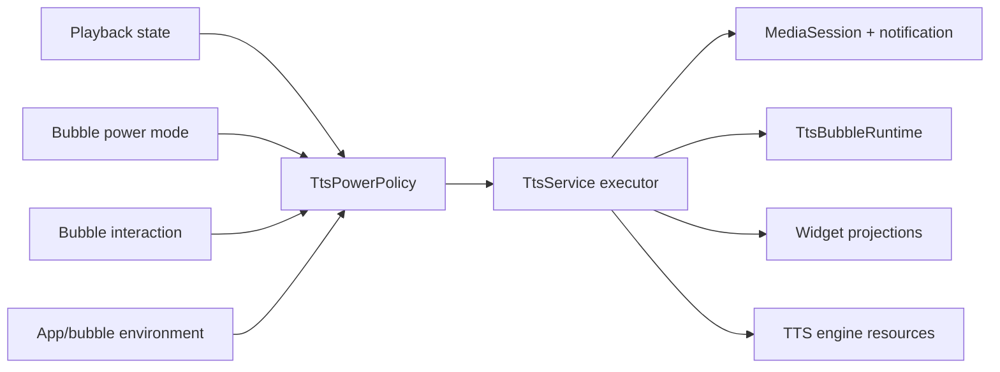

# Thiết kế tối ưu pin cho TTS Service, Bubble và Widget

> Cập nhật: 2026-08-11  
> Trạng thái: Đã được người dùng xác nhận  
> Phạm vi: Thiết kế và kế hoạch kiểm chứng; chưa triển khai code

## 1. Tóm tắt hiểu biết

- EpubPro giữ một `TtsService` làm nguồn sự thật cho playback, MediaSession, notification, bubble và hai home-screen widget.
- Mục tiêu là giảm mức tiêu thụ pin khi Idle và loại bỏ cập nhật nền dư khi Playing mà không tách service hoặc thay đổi kiến trúc playback.
- Bubble có hai mode do người dùng chọn: `ALWAYS_ON` và `BATTERY_SAVER`; `ALWAYS_ON` là mặc định cho cả cài mới và dữ liệu nâng cấp.
- `BATTERY_SAVER` đóng bubble và foreground service sau 5 phút Idle khi app ở background; Paused không tham gia timeout.
- Tương tác bubble khi Idle reset đủ 5 phút. Play từ app hoặc widget dựng lại service, playback và bubble từ snapshot.
- Notification/MediaSession, bubble và widget có cadence riêng; surface không hiển thị không được duy trì ticker.
- Release gate về pin là trung vị hao không quá 2% trong 8 giờ Idle trên thiết bị tham chiếu, qua ít nhất ba lượt đo kiểm soát. Paused được đo diagnostic riêng nhưng không thuộc hard release gate này.

## 2. Hiện trạng và động lực

### 2.1 Những gì đã đúng

- Chỉ có một `TtsService`; bubble và widget không tạo service riêng.
- Hai widget đặt `updatePeriodMillis="0"`, nên không có periodic update do launcher.
- Bubble Idle không có polling loop riêng.
- Playback generation đã bảo vệ phần lớn callback engine và restore muộn.
- Snapshot không lưu toàn bộ nội dung sách và app không auto-play sau reboot.

### 2.2 Chi phí nền đã xác định trong code

- `TtsService.onCreate()` khởi tạo Android Native TTS và gọi initialize cho Piper ngay cả khi service chỉ được dựng để giữ Bubble Idle.
- Bubble khả dụng khiến `onStartCommand()` trả `START_STICKY`, nên service và các tài nguyên đã dựng có thể tồn tại vô thời hạn sau Stop.
- Khi Playing, job một giây cập nhật MediaSession, rebuild notification và recompose bubble; widget projection được persist và broadcast theo nhịp 5 giây.
- `TtsWidgetStateStore.saveState()` dùng synchronous `SharedPreferences.commit()`; position thay đổi khiến state thường xuyên bị coi là mới.
- Mỗi widget provider nhận cùng custom broadcast rồi gọi cập nhật cả chính nó lẫn provider còn lại. Vì cả hai receiver đều nhận broadcast, một state event có thể tạo nhiều full `RemoteViews` update dư.
- Provider decode ảnh bìa lại trong mỗi full update.

Android ghi nhận full widget update là loại update tốn tài nguyên nhất và khuyến nghị tối ưu loại, tần suất và thời điểm cập nhật. Foreground service cũng chỉ nên tồn tại khi đang thực hiện công việc người dùng nhận biết rõ.

## 3. Mục tiêu, non-goals và ràng buộc

### 3.1 Mục tiêu

1. Cung cấp hai mode vòng đời bubble rõ ràng cho người dùng.
2. Chấm dứt service và tài nguyên nặng sau grace period ở Battery Saver.
3. Không còn periodic widget write/broadcast/render khi Idle.
4. Chỉ cập nhật progress ở surface đang hiển thị với cadence đã xác nhận.
5. Giữ snapshot và khả năng resume từ app/widget sau shutdown.
6. Có policy thuần, dễ unit test và chống race.
7. Đạt release gate pin 2%/8 giờ trên thiết bị tham chiếu.

### 3.2 Non-goals

- Không tách `AudioBubbleService` hoặc tạo thêm foreground service.
- Không migrate sang Media3.
- Không thay đổi cơ chế tổng hợp Native TTS/Piper ngoài lazy initialization và lifecycle release.
- Không timeout trạng thái Paused và không đưa Paused vào hard release gate 2%/8 giờ; vẫn phải đo diagnostic để ghi nhận chi phí chủ đích của quyết định UX này.
- Không auto-start sau reboot, force-stop hoặc process death trong Battery Saver.
- Không thêm AlarmManager, WorkManager, wake lock hoặc analytics để quản lý timeout.
- Không thay đổi kiến trúc repository, database hoặc nội dung AI.

### 3.3 Yêu cầu phi chức năng

- **Hiệu năng:** không full widget update theo ticker; không notification rebuild mỗi giây nếu nội dung/action không đổi; không bubble ticker khi không hiển thị.
- **Quy mô:** một user local, một playback session, một bubble; hỗ trợ nhiều instance của mỗi loại widget.
- **Bảo mật/quyền riêng tư:** service và internal receivers không exported; PendingIntent explicit/immutable; không log nội dung sách hoặc snapshot.
- **Độ tin cậy:** Play/Stop/mode change idempotent; callback timer/engine cũ không được tác động phiên mới; snapshot giữ backward compatibility.
- **Bảo trì:** policy Android-independent; thay đổi tối thiểu quanh kiến trúc hiện tại; không phân tán điều kiện tiết kiệm pin ở nhiều UI component.

## 4. Các phương án đã xem xét

| Phương án | Ưu điểm | Nhược điểm | Kết luận |
|---|---|---|---|
| Power Policy tập trung | Rule testable, thay đổi vừa phải, giữ một service | Cần tách trách nhiệm khỏi `TtsService` cẩn thận | **Được chọn** |
| Patch timer/throttle trực tiếp | Diff ban đầu nhỏ | Điều kiện phân tán, khó chống race và bảo trì | Không chọn |
| Reactive pipeline hoàn chỉnh | State propagation sạch và mở rộng tốt | Refactor lớn, regression cao | Không chọn |

## 5. Kiến trúc được chọn

### 5.1 Mô hình mode

```kotlin
enum class TtsBubblePowerMode {
    ALWAYS_ON,
    BATTERY_SAVER
}
```

`TtsBubblePowerMode` là một phần của `TtsBubblePreferences`, độc lập với:

- `enabled`;
- `pendingEnable`;
- vị trí bubble;
- `hiddenForCurrentSession`.

### 5.2 TtsPowerPolicy

Thêm `TtsPowerPolicy` thuần, không giữ `Context`, coroutine hoặc Android service API. Input gồm:

- power mode;
- playback state;
- bubble enabled/permission/availability;
- app foreground/background;
- sự kiện tương tác bubble;
- trạng thái surface Collapsed/Expanded/Hidden.

Output là quyết định có kiểu rõ ràng, ví dụ:

- `StartIdleTimeout`;
- `CancelIdleTimeout`;
- `ShutdownIdleRuntime`;
- cadence bubble hiện tại;
- surface widget nào có projection thay đổi.

Policy không tự thực thi side effect. `TtsService` tiếp tục là owner duy nhất của lifecycle và command.

### 5.3 Quan hệ thành phần



### 5.4 Bubble runtime events

`TtsBubbleRuntime` phát callback cấp cao, đã distinct, về service:

- app visibility thay đổi;
- bubble state Collapsed/Expanded/Hidden thay đổi;
- tap hoặc expand/collapse;
- drag start và drag end;
- overlay permission/availability thay đổi.

Không phát interaction callback theo từng pointer-move frame. Callback môi trường và command tiếp tục được serialize trên main dispatcher.

**Overlay failure latch** là cờ runtime do `TtsBubbleOverlayController` sở hữu để chặn vòng lặp attach/update lỗi liên tục. Controller set cờ khi `WindowManager.addView()` hoặc `updateViewLayout()` ném `SecurityException`/`RuntimeException`; trong lúc latch, bubble được coi là unavailable và controller không thử attach lại theo render tick. Chính controller chỉ clear cờ khi bubble bị disable rồi enable lại, hoặc một environment refresh rõ ràng xác nhận overlay permission hợp lệ; timer không tự clear latch và `TtsPowerPolicy` chỉ đọc trạng thái đã dẫn xuất.

## 6. Lifecycle và state transition

### 6.1 Điều kiện bắt đầu timeout

Battery Saver chỉ bắt đầu countdown khi đồng thời:

1. Player là `Idle` hoặc `Completed`.
2. Bubble preference đang enabled.
3. Overlay permission còn hợp lệ và [overlay failure latch](#54-bubble-runtime-events) không active.
4. EpubPro đang ở background.

`ALWAYS_ON` không tạo Idle timeout.

### 6.2 Hủy và reset timeout

- Play/Previous/Next hoặc bất kỳ transition nào rời Idle: hủy.
- App vào foreground: hủy.
- Tắt bubble hoặc mất overlay permission: hủy.
- Chuyển sang Always On: hủy.
- Tương tác bubble trong Idle: reset lại đủ 5 phút.
- App trở lại background trong Idle: bắt đầu một deadline mới đủ 5 phút.
- Paused: không bắt đầu và không duy trì Idle timeout.

### 6.3 Chống race

Mỗi Idle episode có `idleEpisodeId` tăng đơn điệu. Mọi thao tác rời Idle hoặc thay đổi eligibility tăng ID trước khi cancel job.

Khi timer hoàn tất, service kiểm tra lại:

- episode ID;
- playback generation;
- power mode;
- playback state;
- app visibility;
- bubble availability.

Chỉ khi tất cả còn hợp lệ mới shutdown. Vì timer callback và command được xử lý trên main dispatcher, Stop → Play sát deadline không thể khiến timer cũ đóng phiên mới.

### 6.4 Thứ tự shutdown

1. Ghi `TtsPlaybackSnapshot`/cursor cuối nếu thay đổi bằng durable `commit()` trên dispatcher IO và chờ kết quả trước khi tiếp tục shutdown.
2. Invalidate playback generation.
3. Hủy progress, restore, chapter preparation và sleep timer liên quan.
4. Dừng engine và bỏ AudioFocus.
5. Đưa MediaSession về stopped.
6. Gỡ bubble overlay và foreground notification.
7. Kết thúc foreground episode, clear started ownership và gọi `stopSelf()`.
8. `onDestroy()` release Native TTS, Piper/Sherpa, MediaSession, tracker và bitmap còn giữ.

Nếu Activity foreground/bound thì eligibility đã false, nên timeout không được phép tới bước shutdown. Điều này tránh hủy engine scope của một service mà UI vẫn đang điều khiển.

Shutdown là một suspend flow: sau khi quay lại từ snapshot I/O, service kiểm tra lại `idleEpisodeId` và toàn bộ eligibility trước bước 2. Nếu user đã Play trong lúc chờ ghi, phần shutdown còn lại bị hủy. `TtsWidgetStateStore` là cache dẫn xuất và không nằm trên durability boundary này.

### 6.5 Độ chính xác deadline

Timeout dùng coroutine `delay` và `SystemClock.elapsedRealtime()`, không dùng alarm hoặc wake lock. Năm phút là thời gian grace tối thiểu. Nếu thiết bị deep sleep, callback có thể chạy muộn tới lần process được scheduling tiếp theo; app không được đánh thức chỉ để tự đóng service.

Process bị Android kill trong grace period được coi là shutdown sớm hợp lệ ở Battery Saver.

## 7. Khởi tạo và phục hồi engine

### 7.1 Lazy initialization

`TtsService.onCreate()` chỉ dựng thành phần nhẹ:

- MediaSession/controller;
- preference/store;
- bubble runtime/tracker;
- engine wrapper ở trạng thái chưa initialize.

Không gọi `AndroidNativeTtsEngine.initialize()` hoặc load Piper/Sherpa model chỉ để hiển thị Bubble Idle.

Khi một lệnh playback chuyển sang Preparing:

1. Chọn engine từ settings hiện tại.
2. Apply language, speed, pitch và voice.
3. Initialize đúng engine nếu chưa ready.
4. Chỉ phát câu sau callback ready và kiểm tra generation.

Paused giữ engine hiện tại để Resume không phải load lại. Battery Saver timeout kết thúc service, nên lần Play sau nhận một service/engine lifecycle mới.

### 7.2 Restore sau timeout

Preference sau timeout vẫn giữ:

- `enabled=true`;
- `powerMode=BATTERY_SAVER`;
- bubble position;
- playback snapshot.

Play từ app hoặc `PendingIntent.getForegroundService()` của widget là explicit user action:

1. Dựng service mới.
2. Promote foreground ở Preparing.
3. Đọc và validate snapshot bất đồng bộ.
4. Load sách/chương/câu.
5. Initialize engine đã chọn.
6. Bắt đầu audio và hiển thị lại bubble cho phiên mới.

Không auto-play từ sticky restart, reboot hoặc background worker.

## 8. Foreground service semantics

| Trường hợp | Kết quả `onStartCommand()` |
|---|---|
| Bubble khả dụng + Always On | `START_STICKY` |
| Bubble khả dụng + Battery Saver | `START_NOT_STICKY` |
| Bubble tắt/mất quyền | `START_NOT_STICKY` |

Battery Saver dùng `START_NOT_STICKY` cả khi Playing. Nếu process bị kill, snapshot cho phép user chủ động resume nhưng app không tự dựng Bubble Idle hoặc tự phát audio.

Foreground types tiếp tục theo state:

- Bubble Idle Always On hoặc Battery Saver grace period: `specialUse`.
- Playing/Preparing/Paused có bubble: `specialUse | mediaPlayback` khi platform yêu cầu.
- Playback không bubble: `mediaPlayback`.

Không thay đổi manifest permission hoặc special-use subtype ngoài việc giữ mô tả hiện có.

## 9. Chiến lược cập nhật surface

### 9.1 Playback clock chung

Chỉ giữ một timeline dựa trên `SystemClock.elapsedRealtime()`. Position được tính từ start anchor và elapsed duration, không tăng bằng phép cộng mỗi tick.

### 9.2 MediaSession và notification

MediaSession nhận `positionMs` và `playbackSpeed` tại:

- AudioStarted;
- Pause/Resume;
- seek/Previous/Next;
- đổi chunk/chapter;
- Error/Completed/Stop.

Android tự ngoại suy vị trí khi playback speed khác 0. Notification chỉ rebuild khi một trong các dữ liệu semantic đổi:

- title/snippet;
- playback state;
- play/pause action;
- open-book PendingIntent;
- foreground service type/episode.

Không rebuild notification mỗi giây. Người dùng vẫn nhận progress realtime qua MediaSession mà không tạo NotificationManager IPC liên tục.

### 9.3 Bubble

| Bubble/player state | Cadence |
|---|---:|
| Expanded + Playing | 1 giây |
| Collapsed + Playing | 5 giây |
| Hidden hoặc app foreground | Không ticker |
| Idle/Paused/Preparing/Error/Completed | Không progress ticker; update ngay theo event |

Collapsed ↔ Expanded hủy job cadence cũ trước khi tạo job mới. Model dùng equality/distinct check để tránh Compose recomposition khi dữ liệu render không đổi.

### 9.4 Widget projection

Hai projection được diff độc lập:

- **Audio widget:** book/chapter, playback status, current chunk boundary, snapshot availability, cover và event position.
- **Reading widget:** book/chapter, paragraph index/text, total paragraphs, snapshot availability và cover.

Không có widget ticker. `TtsWidgetStateStore` chỉ ghi khi persisted projection thực sự thay đổi và trả về change set theo surface.

Widget projection là cache dẫn xuất, không phải dữ liệu phục hồi playback. Vì vậy store chuyển từ synchronous `commit()` sang `apply()`:

- cập nhật in-memory `StateFlow` và tính change set ngay;
- enqueue disk write bất đồng bộ;
- không chặn main thread ở mỗi state/chunk transition;
- chấp nhận projection trên disk có thể chậm hơn một event nếu process bị kill đột ngột.

Durability-critical write là `TtsPlaybackSnapshotStore`, không phải widget store. Snapshot cuối ở shutdown tiếp tục dùng synchronous `commit()`, nhưng chạy trên IO và được await trước `stopSelf()` như mô tả ở mục 6.4. Hai cơ chế ghi không dùng chung semantics.

Dùng hai internal action riêng:

- `ACTION_AUDIO_WIDGET_STATE_CHANGED`;
- `ACTION_READING_WIDGET_STATE_CHANGED`.

Mỗi provider chỉ xử lý action của mình, không gọi provider còn lại.

### 9.5 RemoteViews cost

- Full update chỉ dùng trong `onUpdate()`, host recreation hoặc first render.
- State/progress/text/icon thường dùng partial update.
- Provider kiểm tra `appWidgetIds` trước khi đọc store hoặc decode ảnh.
- Ảnh bìa decode chỉ khi path/file timestamp đổi và cache giới hạn một ảnh đã scale cho mỗi provider.
- Nhiều widget ID cùng loại dùng chung state và bitmap decode của một event.

## 10. Settings và persistence

### 10.1 UI

Giữ `AudioBubbleSettingsCard` và switch hiện tại. Khi bubble enabled, hiển thị selector:

- **Luôn bật** — “Giữ bong bóng sẵn sàng kể cả khi đã dừng đọc.”
- **Tiết kiệm pin** — “Tự đóng bong bóng sau 5 phút không hoạt động khi TTS đã dừng và EpubPro chạy nền.”

Selector dùng semantics/accessibility label rõ ràng. Chọn mode không xin thêm permission.

### 10.2 Thay mode runtime

- Always On → Battery Saver trong Idle/background: tạo deadline mới 5 phút.
- Battery Saver → Always On: hủy deadline.
- Nếu Battery Saver service đã dừng nhưng user chuyển sang Always On từ Settings, màn hình thực hiện explicit sync để dựng lại idle bubble service.
- Đổi mode khi Playing/Paused không làm gián đoạn playback.
- Tắt bubble khi Idle dừng service ngay; khi Playing/Paused chỉ gỡ overlay và giữ media playback.

### 10.3 Codec migration

Nâng `TtsBubblePreferencesCodec` lên schema 2 và hỗ trợ đọc schema 1:

- schema 1 hợp lệ → giữ nguyên mọi field và thêm `ALWAYS_ON`;
- schema 2 → decode đầy đủ;
- dữ liệu lỗi → `enabled=false`, `powerMode=ALWAYS_ON` và các default an toàn khác.

Không chạy migration job. Giá trị schema mới được ghi atomically ở lần user thay đổi preference tiếp theo.

Deadline và thời gian còn lại không persist.

## 11. Lỗi và edge cases

- **Overlay permission bị thu hồi:** gỡ overlay. Playing/Paused tiếp tục qua media notification; Idle dừng ngay.
- **Notification permission bị từ chối:** giữ bubble behavior hiện tại; Battery Saver timeout bình thường.
- **Khóa màn hình:** overlay ẩn nhưng Idle countdown tiếp tục. Unlock không reset; chỉ interaction bubble reset.
- **Hidden for current session:** Idle countdown vẫn chạy. New playback session xóa cờ theo behavior hiện tại.
- **Foreground promotion thất bại:** lưu snapshot, invalidate callbacks, release runtime và dừng service; không retry nền.
- **Snapshot/sách bị xóa:** xóa snapshot lỗi, disable playback controls, điều hướng về Library; không giữ Idle service chỉ để báo lỗi.
- **Đổi clock/timezone:** không ảnh hưởng vì dùng elapsed realtime.
- **Nhiều lệnh lặp:** Stop Idle, cancel timeout, release và mode sync đều idempotent.
- **Nhiều widget instance:** một lần đọc state và bitmap decode cho mọi ID cùng loại.
- **OEM delay:** partial/full widget update có thể được launcher trì hoãn; playback không phụ thuộc widget render acknowledgement.

## 12. Bảo mật và quyền riêng tư

- Giữ `TtsService` exported false.
- Chuyển hai `AppWidgetProvider` sang `android:exported="false"`; privileged system components vẫn có thể gửi lifecycle broadcast, app khác không thể spam custom action.
- Smoke test `APPWIDGET_UPDATE`/restore trên API 26, 30/31, 34+ và OEM mục tiêu trước release.
- PendingIntent tiếp tục explicit và immutable.
- Không thêm content, snapshot, book path hoặc battery measurement vào production log.
- Giữ `FLAG_SECURE` cho bubble expanded.
- Không thêm permission, wake lock, exact alarm hoặc boot receiver.

## 13. Chiến lược kiểm thử

### 13.1 Unit test

- `TtsPowerPolicy`: hai mode × toàn bộ playback state × app visibility × bubble availability.
- Virtual time: 4:59 chưa shutdown, 5:00 shutdown.
- Interaction reset đủ 5 phút.
- Stop → Play sát deadline; timer cũ không shutdown phiên mới.
- Mode switch, disable bubble, permission revoke và foreground transition.
- Paused không bao giờ tạo Idle timeout.
- Schema 1 → Always On; schema 2 round-trip; malformed codec.
- Surface cadence cho Expanded/Collapsed/Hidden.
- Widget change set: audio-only, reading-only, both và no-op.
- Projection equality không commit hoặc broadcast lại.
- Widget state update dùng `apply()` và không tạo synchronous disk write trên main thread.
- Snapshot shutdown dùng `commit()` trên IO; Play trong lúc await làm revalidation thất bại và hủy shutdown.

### 13.2 Instrumentation/device test

- Idle Battery Saver giữ runtime trước deadline và dừng sau deadline.
- App foreground hủy timer; background tạo deadline mới.
- Always On không timeout.
- Paused không timeout và Resume không reload ngoài ý muốn.
- Widget Play sau shutdown dựng lại snapshot/playback/bubble.
- Process kill trong hai mode.
- Recent Apps, lock/unlock, rotation và dark mode.
- Grant/deny/revoke overlay và notification permission.
- `specialUse ↔ mediaPlayback` không mất hoặc nhân notification.
- Hai provider exported false vẫn nhận widget lifecycle broadcast.
- Nhiều instance của cả hai widget không nhân số lần decode/render ngoài số ID cần thiết.

Ma trận tối thiểu: API 26, API 30/31, API 34+ và ít nhất một Samsung hoặc Xiaomi nếu có thiết bị.

## 14. Battery acceptance test

### 14.1 Idle release gate

Hard release gate này **chỉ bao phủ nhánh Idle**: Play → Stop → app background. Nó không chứng minh mức tiêu thụ pin của Paused, vì Paused chủ đích giữ foreground media service và engine đã initialize để Resume nhanh.

Trên một thiết bị tham chiếu được ghi rõ model, API, tuổi pin và build:

1. Dùng release/profileable APK.
2. Giữ cùng trạng thái radio, tài khoản, nhiệt độ môi trường và mức pin bắt đầu.
3. Reset `batterystats`.
4. Bật Bubble + Battery Saver.
5. Phát TTS, Stop và đưa app background.
6. Rút cáp/ADB để tránh cấp điện, tắt màn hình và chờ 8 giờ.
7. Kết nối lại, ghi battery level, `batterystats` và bugreport.
8. Lặp ít nhất ba lần, lấy trung vị.

**Điều kiện đạt:** trung vị hao pin không quá 2% trong 8 giờ.

Always On và device idle không chạy EpubPro được đo làm control để chẩn đoán nhiễu, nhưng release gate chính vẫn là ngưỡng tuyệt đối.

### 14.2 Paused-and-backgrounded diagnostic

Chạy thêm một phép đo tham khảo trong cùng điều kiện thiết bị:

1. Phát TTS tới khi audio đã bắt đầu.
2. Pause và đưa EpubPro xuống background.
3. Giữ màn hình tắt trong 8 giờ mà không Resume/Stop.
4. Ghi battery delta, thời gian foreground service tồn tại, process residency, engine/AudioTrack state và AudioFocus state.

Đây không phải hard pass/fail gate trong phạm vi hiện tại. Kết quả phải được lưu cùng báo cáo Idle để chi phí của quyết định “Paused không timeout” được nhìn thấy rõ. Chạy ít nhất một lượt cho Native TTS và một lượt cho Piper nếu bản release hỗ trợ cả hai; nếu số liệu bất thường hoặc cao hơn đáng kể so với Idle, lặp ba lượt và mở lại quyết định lifecycle Paused trước một đợt tối ưu tiếp theo.

### 14.3 Diagnostic profiling

Dùng Power Profiler/System Trace cho bài test ngắn để xác nhận sau deadline:

- service/process không còn do bubble giữ;
- không còn progress job;
- không có widget SharedPreferences write hoặc broadcast định kỳ;
- không có notification rebuild định kỳ;
- không có Compose bubble recomposition;
- không có engine thread/AudioTrack còn sống.

Với kịch bản Paused, trace phải xác nhận chính xác tài nguyên nào còn sống thay vì kỳ vọng process biến mất.

Battery Historian không còn được Android duy trì tích cực; `batterystats` vẫn phù hợp cho phép đo dài và bugreport, còn Power Profiler/System Trace dùng để gắn mức tiêu thụ với event cụ thể.

Bài test 8 giờ là release gate thủ công, không đưa vào CI.

## 15. Rủi ro và biện pháp giảm thiểu

| Rủi ro | Biện pháp |
|---|---|
| Mức pin 1% có độ phân giải thô và nhiễu hệ thống | Ba lượt, lấy trung vị, cùng thiết bị/điều kiện, lưu bugreport |
| Lazy engine init tăng latency Play đầu tiên | Giữ Preparing đúng nghĩa; đo startup Native và Piper trên thiết bị thật |
| Paused giữ engine/FGS nhưng không nằm trong Idle release gate | Chạy diagnostic 8 giờ riêng cho Native/Piper, công bố số liệu và mở lại policy nếu chi phí bất thường |
| MediaSession extrapolation khác nhau theo OEM | Smoke test notification/lock-screen controls trên matrix thiết bị |
| Coroutine timeout chạy muộn trong deep sleep | Chấp nhận best-effort; không đánh thức máy bằng alarm/wake lock |
| START_NOT_STICKY làm Battery Saver không phục hồi bubble sau kill | Đây là behavior đã chọn; snapshot + explicit Play là recovery path |
| Receiver exported false có khác biệt OEM launcher | Instrumentation/smoke test API 26/30/34 và OEM trước release |
| Partial RemoteViews giữ state cũ sau host recreation | `onUpdate()` luôn full render từ persisted projection |
| Race giữa timeout và playback callback | Episode token + playback generation + main-thread serialization |
| FGS `specialUse` bị Play review | Giữ subtype rõ ràng và không mở rộng use case |

## 16. Nhật ký quyết định

| Quyết định | Phương án thay thế | Lý do chọn |
|---|---|---|
| Hai mode Always On/Battery Saver | Một behavior cố định | Cho người dùng tự chọn UX và pin |
| Always On mặc định cho mọi user | Tự migration sang Battery Saver | Không âm thầm đổi behavior đã có |
| Idle grace period 5 phút | Đóng ngay; 15 phút | Cân bằng thao tác lại và pin |
| Timeout chỉ Idle/Completed | Timeout cả Paused; Paused 30 phút | Pause được giữ như phiên media đang hoạt động |
| Paused có diagnostic riêng, không hard gate | Không đo Paused; đưa Paused vào gate Idle | Minh bạch chi phí UX mà không âm thầm đổi quyết định không-timeout |
| Bubble interaction reset timer | Deadline cố định từ Stop | Không đóng bubble khi user còn tương tác |
| Timeout chỉ khi app background | Timeout cả khi UI bound | Tránh hủy service/engine UI đang điều khiển |
| Explicit Play tự dựng lại bubble | Yêu cầu bật lại trong Settings | Giữ trải nghiệm điều khiển liên tục |
| Tối ưu cả Playing | Chỉ thêm setting | Nguồn hao pin còn có ticker/render/write dư |
| Notification event-driven qua MediaSession | Rebuild notification mỗi giây | Android tự ngoại suy position, giảm IPC |
| Bubble Expanded 1s, Collapsed 5s, Hidden none | Mọi surface 1s hoặc 5s | Ưu tiên nơi user đang nhìn |
| Widget event-driven theo projection | Widget ticker | Phù hợp đặc tả cũ và giảm RemoteViews cost |
| Widget cache dùng `apply()`, snapshot cuối dùng `commit()` trên IO | Giữ mọi write synchronous; dùng `apply()` cho cả snapshot | Không block main cho dữ liệu dẫn xuất nhưng vẫn bảo đảm durability của cursor phục hồi |
| Power Policy tập trung | Inline patch; reactive rewrite | Testable với phạm vi regression hợp lý |
| Giữ một TtsService | Tách bubble service | Một state machine, một notification, ít race |
| Battery Saver dùng START_NOT_STICKY | Sticky restart | Không tự giữ runtime sau process kill |
| Không persist deadline | Alarm/WorkManager | Không đánh thức thiết bị chỉ để shutdown |
| Receiver widget exported false | Receiver public | Ngăn external broadcast spam/DoS |
| Idle release gate ≤2%/8h | Gộp cả Paused vào gate; relative-only metric | Có mục tiêu pin tuyệt đối cho nhánh được tối ưu và diagnostic riêng cho Paused |

## 17. Tệp dự kiến bị tác động khi triển khai

- `core/storage/.../TtsBubblePreferencesManager.kt`
- `core/storage/.../TtsBubblePreferencesCodecTest.kt`
- `core/reader/.../tts/TtsService.kt`
- `core/reader/.../tts/bubble/TtsBubbleRuntime.kt`
- `core/reader/.../tts/bubble/TtsBubbleOverlayController.kt`
- `core/reader/.../tts/TtsMediaSessionManager.kt`
- `core/reader/.../tts/TtsWidgetContract.kt`
- `core/storage/.../TtsWidgetStateStore.kt`
- `app/.../widget/TtsAudioWidgetProvider.kt`
- `app/.../widget/TtsReadingWidgetProvider.kt`
- `feature/profile/.../audio/AudioSettingsViewModel.kt`
- `feature/profile/.../audio/AudioSettingsScreen.kt`
- `core/designsystem/.../strings.xml`
- `app/src/main/AndroidManifest.xml`
- Các unit/instrumentation test tương ứng.

Danh sách này là impact map, không phải quyền refactor ngoài scope.

## 18. Tài liệu tham khảo chính thức

- [Foreground services overview](https://developer.android.com/develop/background-work/services/fgs)
- [Foreground service types](https://developer.android.com/develop/background-work/services/fgs/service-types)
- [Advanced widget update optimization](https://developer.android.com/develop/ui/views/appwidgets/advanced)
- [Power Profiler](https://developer.android.com/studio/profile/power-profiler)
- [Macrobenchmark PowerMetric](https://developer.android.com/topic/performance/benchmarking/macrobenchmark-metrics)
- [Batterystats and Battery Historian setup](https://developer.android.com/topic/performance/power/setup-battery-historian)
- [Insecure broadcast receiver mitigation](https://developer.android.com/privacy-and-security/risks/insecure-broadcast-receiver)

